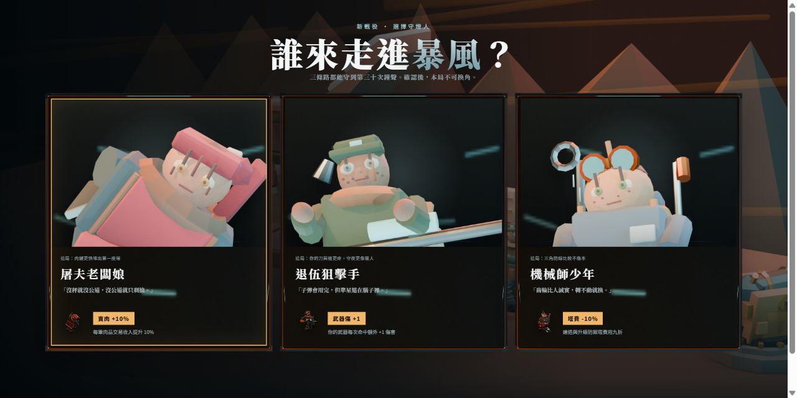
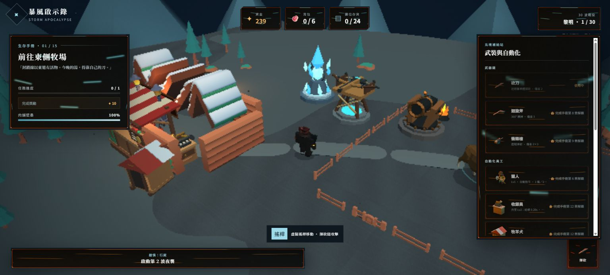
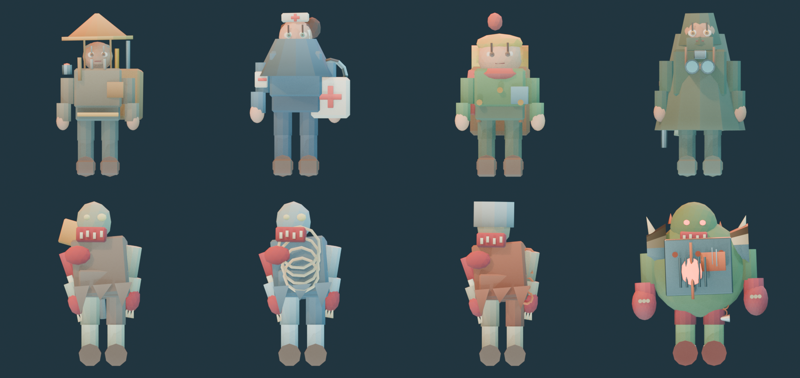

# 暴風啟示錄 Storm Apocalypse

[](https://github.com/mars-tw/storm-apocalypse/actions/workflows/deploy.yml)
[](package.json)
[](LICENSE)

在永夜暴雪中狩獵、經營最後一間肉舖，建立防線並在三十次鐘聲裡守住僅存的燈火。《暴風啟示錄》是一款可直接在瀏覽器遊玩的 3D 經營 × 動作 × 塔防遊戲。

**[立即線上遊玩](https://mars-tw.github.io/storm-apocalypse/)**

[](https://mars-tw.github.io/storm-apocalypse/)

## 最新特色

- **三位可選主角與骨架動畫**：屠夫老闆娘、退伍狙擊手、機械師少年各有專屬模型；Blender 5.1 產線輸出共用 18 骨骨架及 `idle`、`run`、`attack_melee`、`attack_ranged` 動畫片段。
- **R8 角色藝術總修**：主角、四名常客、三種殭屍與 Boss 統一為可重建的 stylized low-poly 視覺，補齊剪影、五官、敘事配件、材質層次與戰鬥反應。
- **Blender 渲染 UI**：角色立繪、主選單背景、圖示、atlas 與 9-slice 元件由同一套 `bpy` 色票及燈光 preset 產出。
- **任務鏈**：15 章生存手冊串起狩獵、肉舖經營、武器、員工、牧場與防禦塔解鎖，夜襲另有輪替目標。
- **30 波戰役**：白晝整備、夜間守備、敵人梯次與每 10 波 Boss 戰，進度保存於瀏覽器本機。
- **R12 聲音與設定中樞**：八類零外部資產的 WebAudio 程序化音效，支援主音量、效果音、靜音、螢幕震動與暫停。
- **R12.1 手機 HUD 分區**：資源／整備、任務、提示、塔列與波次列各自佔位，390×844 與 844×390 具備可見 HUD 互斥 smoke 守門。
- **R13 世界一致性與命中 VFX**：12 個 R8 語言 low-poly GLB 取代舊牛隻、松樹、岩石、柵欄與雪屋外殼；8 張透明戰鬥 VFX 在實際傷害 frame 提供雪爆、木屑、血量警示與地面 decal。
- **R14 modal 互斥**：開場、選角、手機整備、暫停設定與結算開啟時，背景 HUD 同步 `inert`、隱藏且不可命中；1366×600、390×844 與 844×390 納入真實 `elementFromPoint` smoke 守門。
- **R15 暴雪視覺**：gpt-image-2／C2PA 主選單 key art 與程序性 low/medium/high 風雪分級；低畫質只降低天候粒子密度，不改強度行為。
- **R19 直向戰鬥安全框**：極窄手機直向鏡頭依實際上下 HUD 保留可視區，角色姿勢與命中方向不再被底部控制或圍欄遮蔽；旋轉時 Babylon resize 改為穩定後單次重建。
- **R20 終波平衡回歸**：固定 seed 無頭模擬與遊戲共用敵人、武器、塔、彈道及 impact 規則；第 30 波 HP 乘數由 1.08 收斂至 1.07，保留站位差異與一般配置壓力。
- **R21 模擬保真修正**：固定 seed 模擬改用 60 Hz 與分數餘量生成時鐘，移除被量化假象誤導的 W27–30 HP 調整，並以一般 15–40%、滿配 50–70% 的終波區間誠實守門。
- **事件波導演**：白幕突襲與精英壓境會改變敵人組成、血量、速度及出生節奏，不再只有固定數量公式。
- **品質分檔**：依裝置能力自動套用低／中／高畫質，也可在設定中手動選擇自動／高／中／低；動態降級仍會保護幀率。

## 遊戲畫面





## 操作方式

| 平台 | 移動 | 攻擊 | 其他操作 |
| --- | --- | --- | --- |
| 桌機 | `WASD` 或方向鍵 | `Space` 或 `E`；按住可連續攻擊 | `B` 建造、`N` 啟動下一波、`Esc` 暫停／設定；商店與任務亦可用畫面按鈕 |
| 手機／平板 | 左下虛擬搖桿 | 右下「揮砍」按鈕 | 使用畫面按鈕開啟任務、補給站、波次及右上設定 |

## 技術棧

- Vite 8 + TypeScript 7
- Babylon.js 9（WebGL 3D、glTF/GLB、動畫與後製）
- Blender 5.1 `bpy`（程序建模、骨架動畫、角色立繪與 UI 渲染）
- Playwright（桌機、觸控、動畫契約與戰鬥 smoke 測試）
- GitHub Actions + GitHub Pages

目前版本為 **0.2.12**，與 [`package.json`](package.json) 及 lockfile 一致。

## 本地開發

需求：Node.js 22、npm；若要重建美術素材，另需 Blender 5.1。

```bash
npm ci
npx playwright install chromium
npm run dev
```

| 指令 | 用途 |
| --- | --- |
| `npm run dev` | 啟動可供區網存取的 Vite 開發伺服器 |
| `npm run typecheck` | 執行 TypeScript 型別檢查，不產生檔案 |
| `npm run build` | 型別檢查後建立 `dist/` 正式版 |
| `npm run preview` | 預覽 `dist/` |
| `npm run test:smoke` | 以 headless Chromium 驗證桌機、手機、觸控與角色動畫流程 |
| `npm run test:smoke:headed` | 以可見 Chrome 執行 WebGL smoke 驗證 |

送出變更前至少執行：

```bash
npm run typecheck
npm run test:smoke
```

## Blender 5.1 素材產線

以下 PowerShell 命令會覆寫 `public/models/custom/`、`public/images/` 與 R8 證據圖；請從 repo 根目錄執行，完成後務必檢查 Git diff 與 smoke 結果。

```powershell
$blender = 'C:\Program Files\Blender Foundation\Blender 5.1\blender.exe'

& $blender --background --python tools/blender/build_animation_r2.py
& $blender --background --python tools/blender/build_character_pack.py
& $blender --background --python tools/blender/zombie_r8.py
& $blender --background --python tools/blender/boss_zombie.py
& $blender --background --python tools/blender/weapon_pack.py
& $blender --background --python tools/blender/ui_kit.py
& $blender --background --python tools/blender/r8_evidence.py -- --phase after
```

場景道具與建築則由同目錄下的單項腳本重建，例如 `butcher_stall.py`、`cash_register.py`、`doghouse.py`、`meat_slice.py` 與 `coin.py`。產線設計與動畫契約詳見 [`docs/CODEX_RESPONSE_blender_R2.md`](docs/CODEX_RESPONSE_blender_R2.md) 及 [`docs/CODEX_RESPONSE_storm_R8.md`](docs/CODEX_RESPONSE_storm_R8.md)。

## 授權與致謝

專案程式碼及本專案原創素材採 [MIT License](LICENSE)。第三方模型、字型、框架與開發工具的來源、授權及實際用途請見 [CREDITS.md](CREDITS.md)。

維護文件：[Roadmap](docs/ROADMAP.md) · [oss-audit 報告](docs/CODEX_RESPONSE_oss_audit.md)
