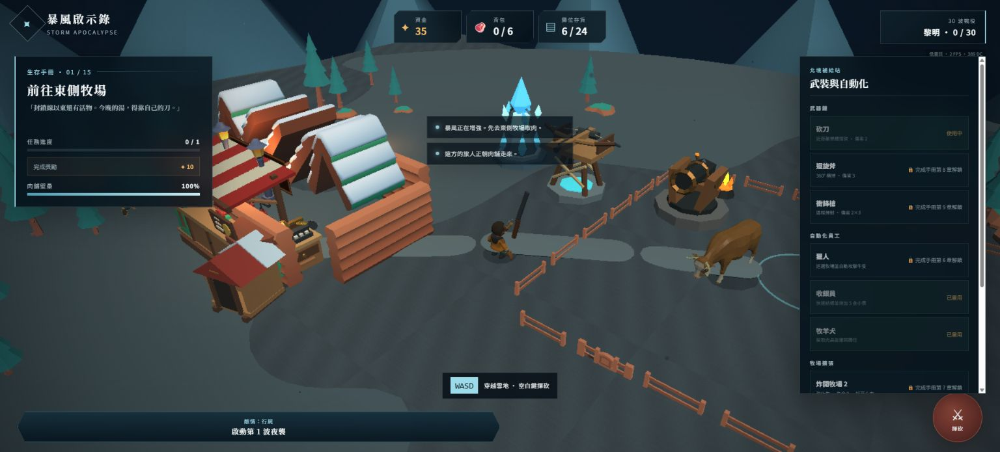
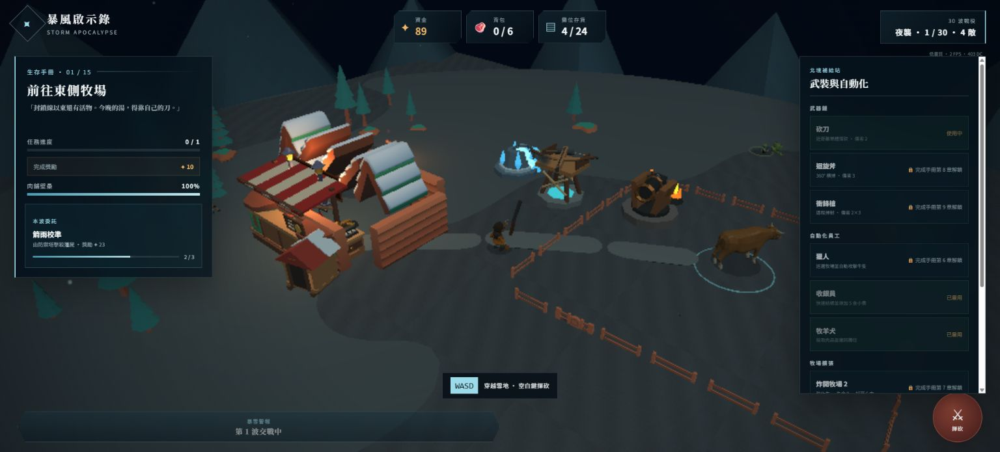

# Blender 程式化低模資產 R1 交付

基準：`41638e7`。本次未執行 `git commit` 或 `git push`。

## 交付摘要

- Blender：5.1.2，以 `C:\Program Files\Blender Foundation\Blender 5.1\blender.exe --background --python <script>` 實際重建。
- 產線：每個模型各有一支 `tools/blender/*.py`，共用低模 helper 為 `tools/blender/blender_utils.py`。
- 建模：全部從 bpy 基礎網格與自訂 vertex/face 程式建立，flat shading，純色 Principled PBR；沒有外部貼圖或現成模型網格。
- 原點／尺度：場景單位為公尺；建築、塔與小屋原點位於地面中心，小物原點位於落地中心；GLB 使用 Y-up 匯出並以 1:1 場景尺度接入 Babylon.js。
- GLB 增量：398,880 bytes（約 0.38 MiB），合計 3,642 tris，低於 3 MB 上限。

## 模型清單與預算

| 模型 | bpy 腳本 | GLB | tris | bytes | 預算結果 |
|---|---|---|---:|---:|---|
| 肉舖攤位 | `butcher_stall.py` | `butcher-stall.glb` | 768 | 87,148 | 建築 <1,500 |
| 收銀台 | `cash_register.py` | `cash-register.glb` | 292 | 34,416 | 小物 <300 |
| 獵風弩塔 | `tower_ballista.py` | `tower-ballista.glb` | 490 | 51,604 | 塔 <800 |
| 寒霜塔 | `tower_frost.py` | `tower-frost.glb` | 302 | 34,000 | 塔 <800 |
| 火砲塔 | `tower_cannon.py` | `tower-cannon.glb` | 508 | 49,060 | 塔 <800 |
| 牧羊犬小屋 | `doghouse.py` | `doghouse.glb` | 328 | 39,876 | 建築 <1,500 |
| 肉片掉落物 | `meat_slice.py` | `meat-slice.glb` | 214 | 22,344 | 小物 <300 |
| 金幣 | `coin.py` | `coin.glb` | 276 | 27,164 | 小物 <300 |
| 裝甲 Boss 殭屍 | `boss_zombie.py` | `boss-zombie.glb` | 464 | 53,268 | 角色 <800 |

模型成品位於 `public/models/custom/`。三座塔的 GLB 內含 `AimPivot` 階層節點，保留原本朝向敵人的旋轉；弩塔只旋轉大弩、寒霜塔旋轉晶簇、火砲塔只旋轉桶砲，基座不會跟著轉。

## 遊戲接入

- `StormGame.ts` 的資產清單載入全部九個自訂 GLB，並停止載入舊共用塔身、共用弩砲與 Holiday 長椅。
- 肉舖以自訂木攤、紅白分片遮陽棚、掛肉架、價格牌與琥珀燈替換原本單色方盒棚架。
- 收銀台、狗屋與三枚金幣成為肉舖周邊實際場景件。
- 三塔完全換成專屬 GLB；既有建造、升級、瞄準、發射與傷害邏輯不變。
- 背包肉片、攤位陳列與地面掉落物全部改用 `meat-slice.glb`。
- 第 10 波倍數的 Boss 改用原創大體型裝甲殭屍 GLB；一般殭屍仍保留原動畫模型。
- 開發環境可用 `?smoke=1&showcase=1` 顯示三塔、肉品與員工，方便可重複做全資產視覺 QA；production build 不啟用此模式。

## 實機截圖驗證

### 白天總覽



- 肉舖棚寬約 5 m，接續現有 Kenney 雪屋模組時比例一致；紅、奶油白、暖木與既有低模純色材質協調。
- 收銀台位於攤位右側，老式機械鍵盤與燈具在俯視距離仍有可讀輪廓；狗屋以紅頂、雪帽與深色入口形成獨立剪影。
- 三塔輪廓不依賴 UI 顏色也能區分：橫向大弩、垂直冰晶、粗短鐵桶砲。
- 模型接地正常，未見浮空、明顯穿模或材質遺失；平面硬邊與既有 Quaternius／Kenney 資產一致。

### 夜襲／發光材質



- 寒霜核心在低照度下維持藍白辨識度；火砲火盆使用橙色 emissive，與肉舖暖燈屬同一暖色系但亮度不過曝。
- 肉舖紅白棚布在夜間仍保有大色塊節奏，不使用高頻貼圖，沒有破壞現有低模風格。
- in-app browser 的實機預覽確認純色材質、塔輪廓差異與 emissive 強度在遊戲鏡頭下均維持可讀性。

## 驗證結果

- `npm run test:smoke`：35 / 35 checks passed，0 failed；桌面、直向觸控、橫向觸控、戰鬥與自動品質情境全綠，瀏覽器 console 0 errors。
- `npm run build`：完成；TypeScript 與 Vite build 0 errors。Vite 僅輸出既有的大 chunk 最佳化提示，非錯誤。
- 實際 GLB 載入：上述 smoke 與兩次本機 showcase 均完成 27 個資產載入，沒有 GLB 網路錯誤或材質解析錯誤。

## 重建方式

在 repo 根目錄逐支執行，例如：

```powershell
& 'C:\Program Files\Blender Foundation\Blender 5.1\blender.exe' --background --python tools/blender/butcher_stall.py
```

腳本會清空暫存 Blender scene、重建網格與材質，並直接覆寫對應的 `public/models/custom/*.glb`，可安全重跑。
