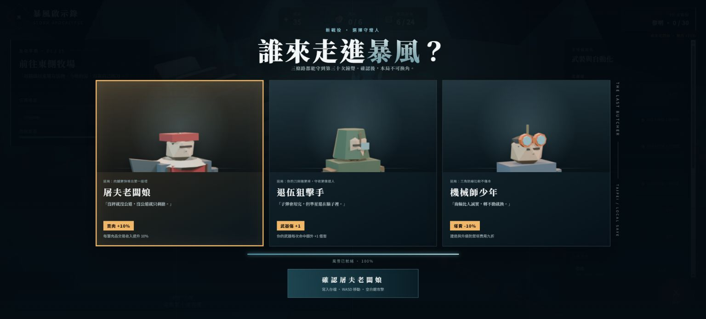
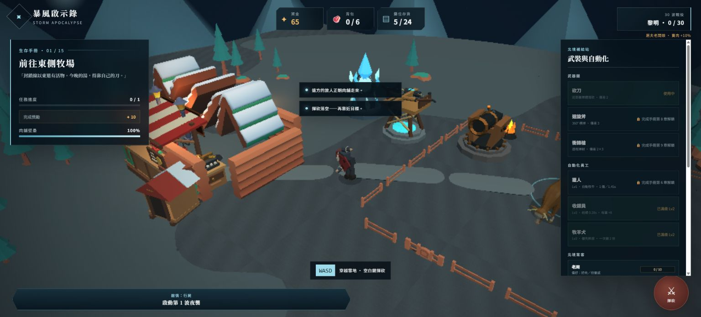
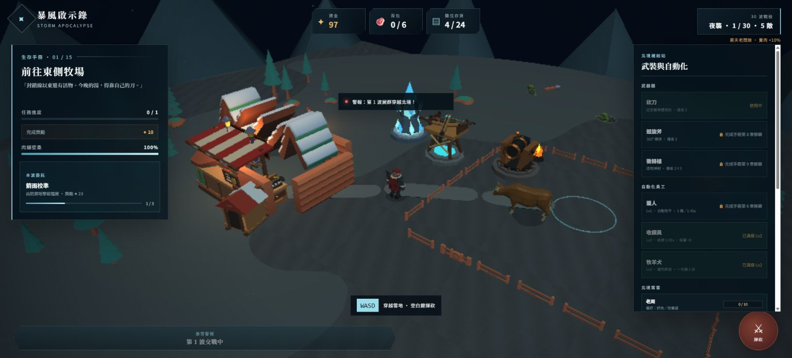

# Blender R2：三主角骨架動畫／三塔動態升級

## 完成摘要

- 三位可選主角已從原本的靜態程序角色重做為全新 R2 低模，各自保留 `docs/DESIGN_characters.md` 的輪廓與配色，並新增同構 18 骨 Armature、剛性分件綁定、武器 socket 與四段 24fps 動畫。
- 三座 R1 塔已全新加模並拆出可動畫階層：弩塔裝填／放箭／後座、寒霜塔晶片公轉／核心脈衝、火砲塔砲管後座／火盆擺焰。
- Babylon.js 已接上主角 one-shot 狀態機、手部武器 socket、塔發射 AnimationGroup 與 24m 動畫 LOD。塔沒有常駐動畫 update；射擊邏輯與投射物傷害不受 LOD 影響。
- 沒有使用 Quaternius 主角素體或現成塔網格；六個 R2 GLB 均由 Blender 5.1.2 `bpy` 從零建模與編動畫。
- 依要求未執行 `git commit` 或 `git push`。

## 模型與動畫實測

下表的 tris、骨架與 clip 名稱不是腳本估算，而是用 Blender 將成品 GLB 再匯入後取得。六個模型合計 690,136 bytes（約 674 KiB）。

| 成品 GLB | 實際 tris | 大小 | 骨架／可動節點 | AnimationGroup |
|---|---:|---:|---|---|
| `characters/protagonist-butcher-matron.glb` | 850 | 141,092 B | 共用 18 骨；紅圍裙、毛領、秤錘、右手切肉刀 | `idle`, `run`, `attack_melee`, `attack_ranged` |
| `characters/protagonist-vet-sniper.glb` | 956 | 151,160 B | 共用 18 骨；軍大衣、單眼護目、長槍與背帶 | 同上 |
| `characters/protagonist-mech-youth.glb` | 864 | 146,072 B | 共用 18 骨；橙框護目鏡、工具腰帶、扳手、肘補丁 | 同上 |
| `tower-ballista.glb` | 896 | 92,028 B | `AimPivot`, `BallistaRecoil`, `BallistaLoader`, `BallistaWindlass` | `attack` |
| `tower-frost.glb` | 536 | 61,896 B | `AimPivot`, `FrostOrbit`, `FrostPulse` | `attack` |
| `tower-cannon.glb` | 984 | 97,888 B | `AimPivot`, `CannonBarrelRecoil`, `BrazierFlame` | `attack` |

三位主角皆低於指定的 1,200 tris；三塔也都低於 1,000 tris。三份 Armature 的骨名與階層完全一致：`root → pelvis → spine → chest → neck/head`，左右肢使用 `.L/.R` 的 `thigh/shin/foot` 與 `upper_arm/forearm/hand`，可直接作同名骨 retarget。遊戲場景同時只 instantiate 已選主角，另外兩位不產生骨架更新成本。

### 24fps clip 時序

| Clip | 幀範圍 | 行為 |
|---|---:|---|
| `idle` | 1–49 | 2 秒呼吸；胸腔縮放、骨盆起伏、頭部細微偏移 |
| `run` | 1–25 | 1 秒無縫循環；左右腿跨步、反向擺臂、軀幹壓低與上下重心 |
| `attack_melee` | 1–24 | 1–7 抬手蓄力、7–13 揮擊與軀幹扭轉、13–19 收勢、19–24 回正 |
| `attack_ranged` | 1–18 | 1–5 雙手舉槍、5–8 瞄準、8–10 後座、10–18 回正 |
| 塔 `attack` | 1–24 | 約 1 秒；各塔的裝填／發射／脈衝／後座與回正 |

## 遊戲狀態機與效能

主角狀態流如下：

`idle ⇄ run`；任何攻擊輸入會以 `attack_melee`（砍刀／斧）或 `attack_ranged`（SMG）立即打斷 locomotion。攻擊期間移動仍可改變角色位置與面向，但 locomotion clip 不會蓋掉攻擊；one-shot 結束事件會回 `idle`，下一幀若仍移動再切 `run`。連續 SMG 會明確 restart 後座 clip。`WeaponSocket` 綁在 `hand.R`，執行期斧／SMG 會跟著手骨；屠夫預設砍刀直接使用 GLB 內的專屬切肉刀。

塔的 `attack` 只在鎖定目標並真正生成投射物時播放。寒霜塔不再由 TypeScript 每幀常駐旋轉；三塔平時 AnimationGroup 均停止。玩家與塔距離超過 24m 時，正在播放的塔 clip 會 `stop + reset` 並標記 `paused`；返回範圍後只等待下一次真實開火再播放，不啟動遠距 idle 動畫。

Canvas smoke 指標新增：`data-player-animation`、`data-player-clips`、`data-tower-animations`、`data-tower-animation-lod`，可在不依賴肉眼的情況下驗證瞬時 clip 與 LOD。

## bpy 產線

- `tools/blender/animated_asset_utils.py`：共用 18 骨建構、bone parenting、四段主角 NLA 與塔物件 NLA helper。
- `tools/blender/hero_rig_factory.py`：三位 R2 主角的全新網格、材質、配件與骨架綁定。
- `tools/blender/tower_ballista.py`、`tower_frost.py`、`tower_cannon.py`：三塔 R2 模型與 `attack` clip。
- `tools/blender/build_animation_r2.py`：一次重建三主角、三張選角圖與三塔。
- `tools/blender/inspect_animated_assets.py`：回匯 GLB 並列出實際 tris、骨名與 clip。

重建命令：

```powershell
& 'C:\Program Files\Blender Foundation\Blender 5.1\blender.exe' --background --python tools/blender/build_animation_r2.py
```

## Smoke／build

- `npm run test:smoke`：PENDING_FINAL_SMOKE
- 新增三位主角逐一選角、四 clip 契約、`idle → run → attack_melee → idle`；桌面與觸控另驗 `attack_ranged`、塔發射 `attack`、遠距塔 `paused`。
- `npm run build`：通過；TypeScript 零錯，Vite production build 成功。僅保留既有 Babylon 大 chunk 警告，沒有新增 build error。
- Blender GLB 回匯：六個成品 clip／節點全部正確，三主角骨架均為同名 18 骨。

## Preview 截圖驗證



- 選角畫面同時顯示屠夫紅圍裙／頭巾、狙擊手軍綠風帽／護目、機械師橙色雙鏡護目；三張新 EEVEE 透明角色圖沒有材質遺失。



- 實際遊戲輸入後，Canvas 指標命中 `attack_melee` 才截圖；中央角色呈現軀幹扭轉、右手切肉刀揮擊姿勢，之後回 `idle`。



- 開波後等到 `ballista:attack,frost:attack,cannon:attack` 同幀才截圖；畫面可見弩塔上層機件、寒霜晶簇擴張脈衝與火砲塔火盆／砲管。in-app Browser console error 為 0。

