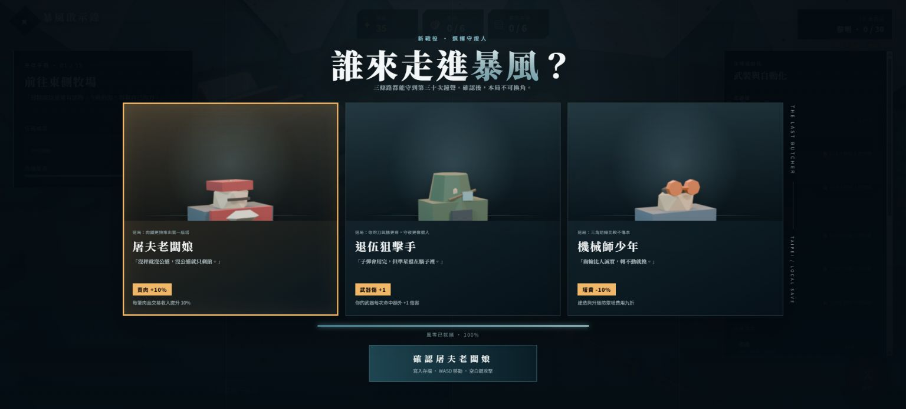
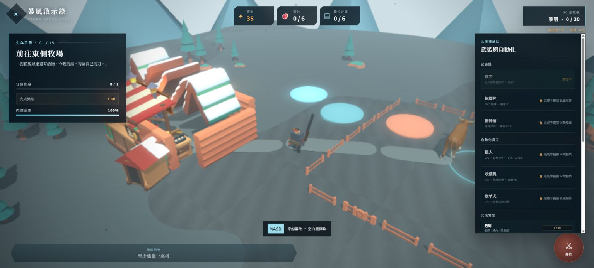

# CODEX 回報：角色系統

完成；未執行 `git commit`／`git push`。

## 實作

- 三主角：新檔開局三選一、角色卡／低模半身圖、確認後鎖定、HUD 被動標示與主角專屬 GLB。
  - 屠夫老闆娘：交易收入 `floor(base × 1.10)`，再疊老周 flat 與小包小費。
  - 退伍狙擊手：砍刀／斧／SMG 每次玩家命中 `+1` 傷害。
  - 機械師少年：建塔／升塔價格 `ceil(list × 0.90)`，UI 與扣款同值。
- 存檔 v3：新增 `protagonistId`、員工 0/1/2、四常客好感、已領獎勵與每整備期好感計數；v2 boolean 員工遷成 1/0，舊檔預設老闆娘，未知值安全回退。
- 四常客：老周／林護理／小包／何偵察以 55/12/12/11/10 初始權重換模到店；偏好加成、每整備期每人最多 +2、3/6/10 一次性獎勵、摯友徽記與四種永久小加成均已接入。
- 員工 Lv2（Ch12 後、夜襲禁購）：
  - 獵人：120 金，攻擊 1.45s→1.10s、移速 2.15→2.40。
  - 收銀：150 金，結帳 0.38s→0.28s、每筆 +5→+8、來客 cooldown 2.2s→1.9s。
  - 牧羊犬：160 金，優先即將過期肉、移速 +20%、2.5m 內一次搬 2 份。

## Blender 5.1 角色包

全部為 flat-shaded、純色 Principled PBR、無貼圖，輸出至 `public/models/custom/characters/`；共用工廠為 `tools/blender/character_factory.py`，一鍵產線為 `tools/blender/build_character_pack.py`，另保留 7 支 `char_*.py` 單模腳本。

| GLB | Tris | 大小 |
|---|---:|---:|
| protagonist-butcher-matron | 400 | 44,360 B |
| protagonist-vet-sniper | 520 | 54,092 B |
| protagonist-mech-youth | 448 | 50,128 B |
| npc-lao-zhou | 300 | 34,872 B |
| npc-nurse-lin | 324 | 37,688 B |
| npc-kid-bao | 370 | 40,656 B |
| npc-scout-he | 348 | 38,876 B |

全數低於主角 650/700、常客 450/600 tris 與 80 KB 建議預算。三主角另由 bpy EEVEE headless 渲染透明選角 PNG。

## 驗證

- `npm run build`：通過；TypeScript／Vite 零錯（僅既有 Babylon 大 chunk 提示）。
- `npm run test:smoke`：**35/35 pass，0 fail**；1440×900、390×844、844×390，console error 0。
- production preview 實測：新檔三卡可切換；確認機械師後 HUD 為「機械師少年 · 塔費 -10%」；重整後選角跳過且角色仍保留；瀏覽器 warning/error 0。

## 主要檔案

- Runtime／v3：`src/game/state.ts`、`src/game/StormGame.ts`
- 角色／常客／價格資料：`src/game/content.ts`
- 選角、常客、升級 UI：`src/game/ui.ts`、`src/styles.css`
- Blender：`tools/blender/blender_utils.py`、`tools/blender/character_factory.py`、`tools/blender/char_*.py`
