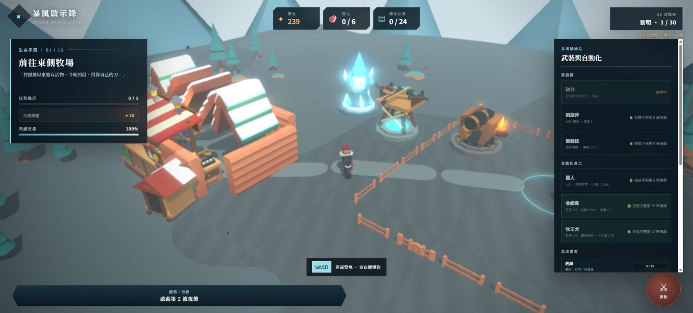
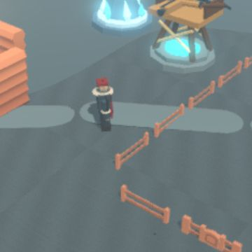

# P0 人物反向移動修正

## 結果

- 根因確認：自製 Blender 角色以 `+Y` 為臉部前方，`export_yup=True` 後在 glTF/Babylon 成為視覺 `-Z`；遊戲 `atan2(direction.x, direction.z)` 則把容器 `+Z` 當前方，因此 R2 主角會背向行進方向。
- 修在產線：`export_glb(..., character_forward=True)` 僅在匯出自製角色時暫時把模型 root 繞 Blender Z 軸轉 180°，匯出後還原場景 root；遊戲移動 yaw 沒有加入特例補償。
- 三主角、四位自製具名顧客與自製 Boss 已重生。`build_animation_r2.py` 也完整重跑六個 R2 GLB；三座塔輸出內容未變。
- 舊 Quaternius `customer.glb`、`cow.glb`、`zombie.glb` 本來就是 `+Z` 前方，檔案未修改。

## 同類資產檢查

| 類別 | 結論 |
|---|---|
| 三主角 | 已加匯出 root 半轉；三者 glTF root quaternion 均為約 `[0, -1, 0, 0]` |
| 四位具名顧客 | 同為 Blender `+Y` 自製資產，已套同一產線修正 |
| 匿名顧客 | Quaternius `+Z`，保持原檔 |
| 牛 | Quaternius 前肢在 `+Z`、後肢在 `-Z`，保持原檔 |
| 一般殭屍 | Quaternius 臉／舌朝 `+Z`，保持原檔 |
| Boss 殭屍 | Blender `+Y` 自製資產，已套同一產線修正 |

root 半轉位於骨架與四段動作之外；Blender 回匯仍是相同 18 骨、`idle/run/attack_melee/attack_ranged`。run 左右步態沒有鏡像，melee/ranged 的出手面向也與角色視覺前方一致。

## 自動驗證

- Canvas 新增 `data-player-mesh-forward-x/z`，值直接來自匯入模型 root 的 world forward，不用遊戲容器 yaw 猜測。
- smoke 對三位主角逐一按住 `D`：run 時 `meshForward=(1.000, 0.000)`；接著 melee attack 仍為 `(1.000, 0.000)`。
- `npm run test:smoke`：**68 / 68 checks passed，0 failed**。
- `npm run build`：TypeScript 零錯、Vite production build 成功；只有既有的大 chunk warning。
- Blender 5.1.2 回匯：三主角皆 18 骨／四 clip；三塔仍各有 `attack` clip。

## Preview 截圖

production preview 在桌面畫面按 `D` 後截圖；角色由 `x=-0.50` 移至 `x=-0.35`，鏡頭投影中頭臉、圍裙正面與武器朝畫面右下方（世界 `+X` 行進側），不是以背部朝前。瀏覽器 console error：0。

未執行 git commit 或 push。
