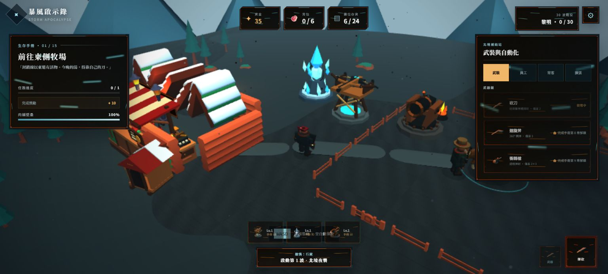
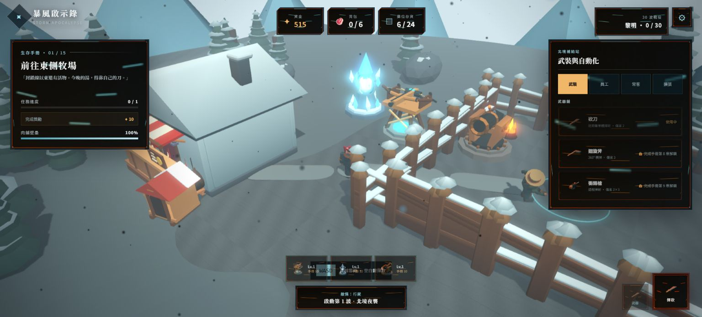
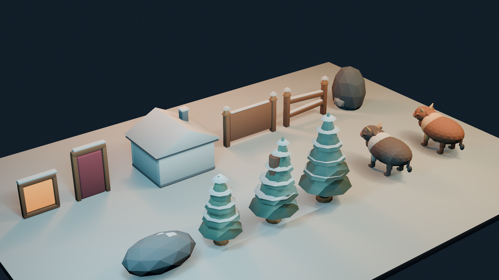
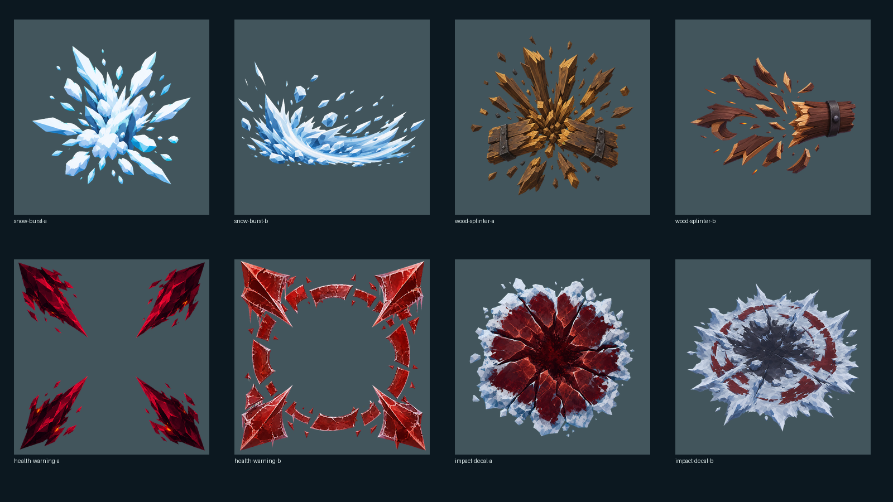

# storm R13 Wave 1 視覺量產回報

storm R13 已完成 Wave 1 世界一致性與戰鬥 VFX，版本升至 **0.2.6**。12 個新 GLB 與 8 張新 RGBA VFX 已接入執行期；typecheck、build、141 項 smoke、秘密掃描與六次 p95 效能閘門全綠。

## 完成內容

- 透過 Blender MCP `localhost:9876` 的 `execute_code` 重建 `cow-brown`、`cow-strong`、3 松樹、2 岩石、2 柵欄與雪屋 shell／door／window。證據 scene 採 Blender 5.1 AgX、R8 暖 key／冷 fill／ember rim／冷 bounce，材質沿用 COLOR_0 明度分面與 roughness 分級。
- 兩頭牛不是整張模型 bobbing：各有 19 骨、四肢對角 Walk、Eating、hurt、Death，且 root collider／移動節點不由視覺 pose 取代。強化牛角與 ember collar 已整合進同一 articulated GLB。
- 以 `gpt-image-2` 生成 snow burst、wood splinter、health warning、impact decal 各 2 變體；保留 opaque master、RGBA master、mask、runtime 與 SHA-256。人工逐像素清理 0 分鐘，去背參數與 alpha QA 10 分鐘。
- VFX 僅在傷害成立時播放：牛與殭屍在 damage function 產生雪爆／decal；壁壘在生命扣除 impact frame 產生木屑／decal／血量 warning，不在 attack input 或 anticipation 提前出現。
- 場景已替換舊牛、松樹、岩石、柵欄與 cabin shell 引用；花環、燈籠等未列入替換範圍的裝飾保留。
- 靜態道具最初因過度分件使 desktop p95 33.4 ms；Blender GLB 與既有無動畫道具均依材質合批，VFX 改為 unit-quad pool，blob shadow／殭屍色環改用 instances，自適應檔卸除陰影與非互動細節。正式 desktop 三跑為 16.7 / 16.8 / 16.8 ms，draw calls 中位數 186。松樹 instance 也從舊 Kenney 放大倍率校回 R13 公尺尺度，避免遮蔽肉舖。

## 驗收數字

| 項目 | 結果 |
| --- | --- |
| 世界 GLB | 12 / 12；7,930 tris；全部 hash／預算／COLOR_0／材質／動畫 gate PASS |
| 牛隻動畫 | 2 / 2；各 19 bones、5 clips |
| VFX | 8 / 8；1024² RGBA；全部 alpha gate PASS |
| Smoke | 141 / 141 PASS（門檻 136+） |
| Desktop p95 | 16.7 / 16.8 / 16.8 ms（median 16.8；186 DC） |
| Mobile p95 | 16.7 / 16.8 / 16.8 ms（median 16.8；139 DC） |
| Typecheck / build / secrets | PASS / PASS / 0 命中 |

完整逐項結果見 [`validation-r13.md`](evidence/R13_art/validation-r13.md)、[`smoke-r13.json`](evidence/R13_art/smoke-r13.json) 與 [`performance-r13.json`](evidence/R13_art/performance-r13.json)。

## Before / After

## 量產證據

未修改角色／既有動畫、`src/game/ui.ts` 或 R12.1 HUD；未 push 遠端。R13 變更以單一 local commit 收尾。
