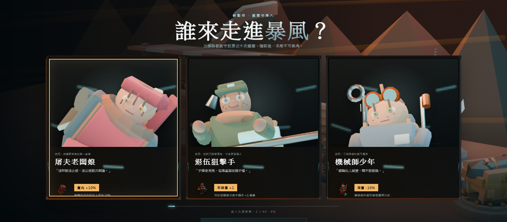
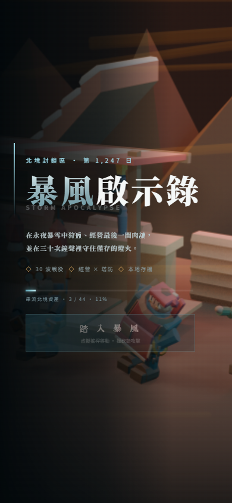
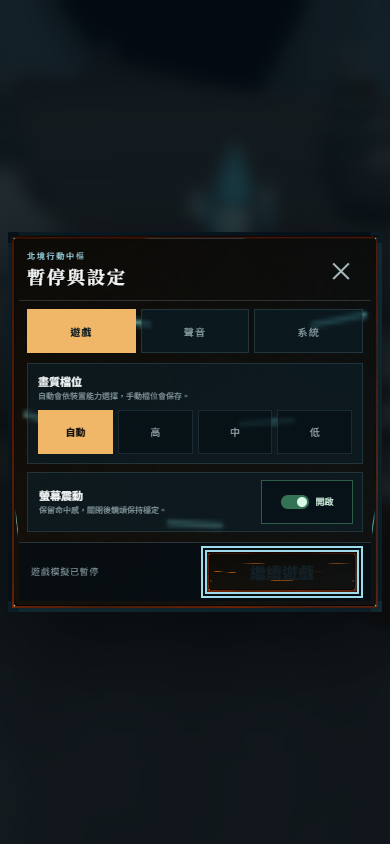

# storm R14 選單重疊檢修回報

storm R14 已將開場、選角、暫停設定與結算統一納入 modal 互斥狀態。版本升至 **0.2.7**，UI marker 升至 **R14**。

## 修復摘要

- 稽核列出的 rect 相交不是單純可忽略的「modal 蓋背景」：修前背景 HUD 沒有 inert／hidden 契約，因此底層整備分頁、武器列表、塔 dock、wave-button 與手機 weapon-button 仍留在視覺／命中樹，按本輪規則判為真問題。
- 新增 `#game-ui` 背景容器。任何 modal 開啟時同步設定原生 `inert`、`aria-hidden="true"` 與 `visibility:hidden`；canvas 也同步 inert／aria-hidden。modal 關閉後才恢復背景。
- intro 的 900ms 離場期間背景仍保持隱藏，動畫完成後才恢復 HUD。手機額外守門確認 start-button 已從 DOM 移除，weapon-button 才重新可見、可命中。
- system／result 使用相同狀態管線；intro／result 開啟時 Esc 不會誤開 system modal，結算若遇到 system 開啟會先安全關閉 system。
- smoke 新增 11 項真實瀏覽器守門：9 項涵蓋 1366×600、390×844 的 intro／selection／system／result 與手機關閉後殘留，另 2 項涵蓋 390×844、844×390 的手機整備抽屜。R14 UI-only 測試模式只在 Vite DEV 且 query 同時含 `smoke`、`ui-only` 時啟用，不進 production 行為。

## 證據與驗證

完整分類、守門契約與 8 張截圖索引見 [`validation-r14.md`](evidence/R14_menu/validation-r14.md)。152 項綠色彙整寫入 [`smoke-r14.json`](evidence/R14_menu/smoke-r14.json)，單次 full 的主機資源失敗原樣保留在 [`smoke-r14-full-attempt.json`](evidence/R14_menu/smoke-r14-full-attempt.json)。

## 閘門

- Typecheck：PASS。
- Production build：PASS。
- R14 全畫面 modal 專項：21/21 PASS（其中 9 項為本輪守門）；整備抽屜 2 項隨手機 layout 情境執行。
- 完整 smoke 邏輯集合：152/152 PASS、0 failure、`allPass=true`。主機低記憶體下以四個 isolated green runs 彙整；來源、數量與 full attempt 失敗均寫入 JSON metadata，沒有隱藏或放寬 timeout。
- 秘密掃描：0 命中。
- `git diff --check`：PASS。

本輪沒有修改角色、敵人或動畫資產；既有 frame／skeletal animation 契約不變。最終僅建立 local commit，不 push。
