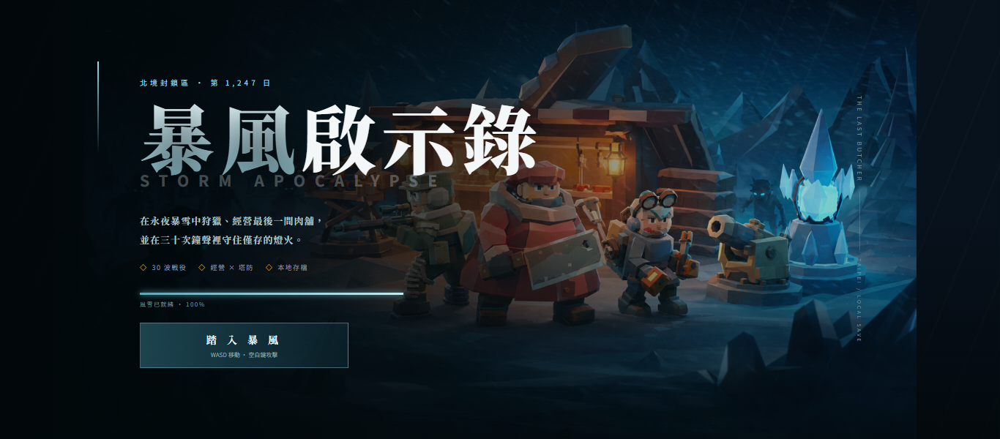
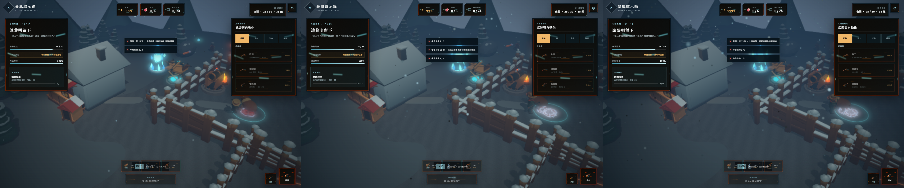
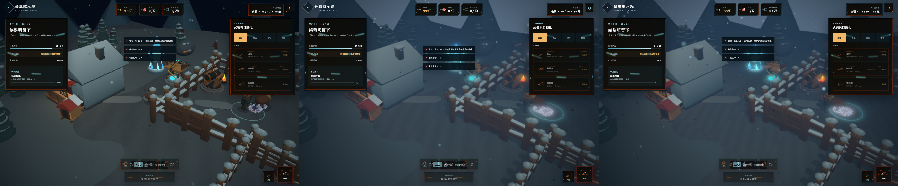

# storm R15（Wave 2）主視覺與天候分級回報

R15 已完成 gpt-image-2 key art 治理、主選單與社群 cover 同步、程序性風雪 low／medium／high 強度、品質密度分級、首屏 preview 與命中幀可讀性驗收。版本升至 **0.2.8**，UI marker 升至 **R15**。

## 完成摘要

- imagegen 原始 master 保留並通過 `softwareAgent = gpt-image 2.0` C2PA 驗證；所有衍生圖的 crop／resize／quantization、hash 與回指均可稽核。
- `assets/cover.png`、`public/images/cover.png` byte-identical；OG／Twitter 與 runtime URL 都使用新內容 hash。
- Fast 3G＋4× CPU 主視覺 287.4 ms 出現，低於 3 秒；桌機／行動新增 decoded texture 分別 9.26／1.35 MiB，低於 64／32 MiB。
- weather 強度只寫視覺參數；品質 low／med／high 只乘粒子密度，motion／life／size／color／fog／post 與生產強度判定不變。
- 最高暴雪下敵人輪廓、實際命中 VFX 與 HUD 皆通過機器可讀性斷言；三強度與三品質的並排圖均已重製。
- 未修改角色／敵人動畫資產、hit frame、damage、hitbox、AI、碰撞、經濟或 wave 數值。

## 證據

完整數字、manifest、前後圖與失敗嘗試索引見 [`validation-r15.md`](evidence/R15/validation-r15.md)。

## 閘門

- Typecheck：PASS。
- Production build：PASS。
- R15 視覺／首屏／RWD／記憶體／天候不變量：19/19 PASS。
- p95：desktop 16.8／16.7／16.7 ms，mobile 16.8／16.7／16.7 ms；六筆皆 ≤18 ms、0 console error。
- 完整 CI 同款 smoke：152/152 PASS、0 failure、`allPass=true`。
- C2PA、cover byte sync、source/weather manifest、舊 shipping marker、PWA/SW、秘密掃描與 `git diff --check`：全部 PASS。

本輪最終只建立 local 繁中 commit，不 push。

## 總稽核審計附註（Claude，2026-07-17，Grok 複審 2 P0 裁決）

- Grok P0-2（靜態截圖冒充可玩性閘門）**駁回**：validation §4 載明腳本等待 VFX counter 增量與命中點投影後凍結實際 active hit frame 才做局部像素斷言（擷取當下 data-vfx-events=20），屬動態命中幀量測；動畫/命中幀契約另由既有 smoke 152 項守門。
- Grok P0-1（1.97/1.80 門檻不足）**降級 P1 記債**：數值高於本產線遊戲實體可讀性既有先例（td 路徑帶 ≥1.25 同型量測），HUD 文字另達 ≥4.5:1；Grok 引用之 3:1 為 WCAG 非文字 UI 元件標準、非遊戲實體內規。品質債：下輪制定跨遊戲實體可讀性正式門檻（含複合遮擋矩陣），若實測玩家回饋不佳即上調並回檢此輪。
- Grok P1 品質債入帳：品質分級僅乘粒子密度（fog/post 不變）→下輪 low 檔應實質降 post 成本；最高暴雪×low 品質交叉矩陣證據補齊；p95 16.7-16.8 貼上緣→出貨判定依統一紀律由總稽核淨機重測，回滾條件：任一 profile 淨機中位 >18ms 即回退 R15 天候層（key art 可留）。
- cover 疑慮排除（總稽核親驗）：assets 與 public 兩路徑皆為 R15 新 key art 且 sha256 一致（326a67a2c3ff）。
- C2PA 1/1 由總稽核親驗 marker；秘密掃描零命中。
