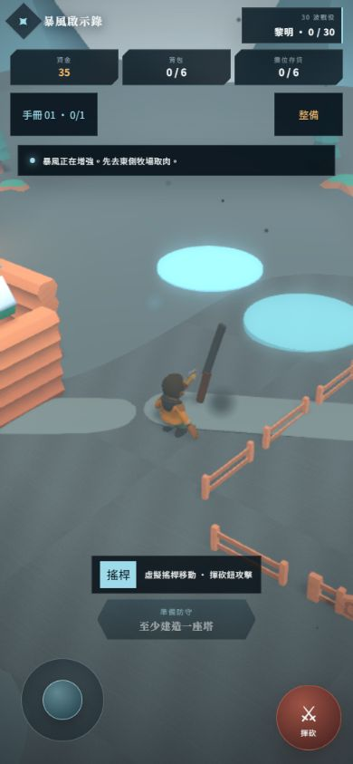
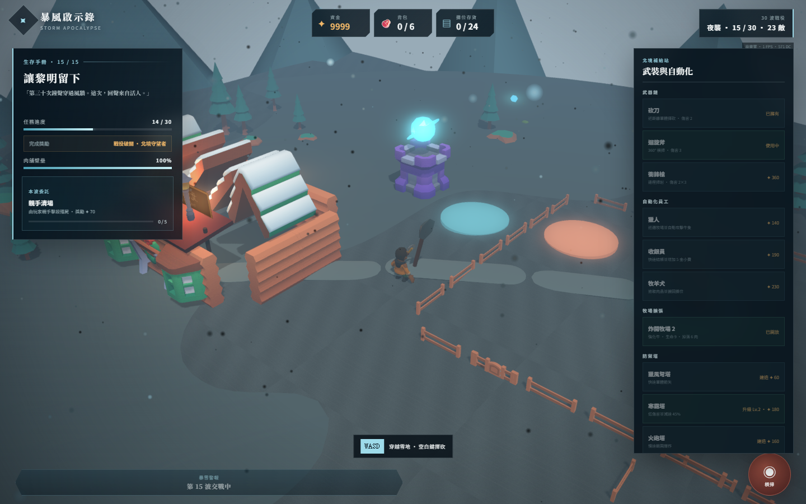
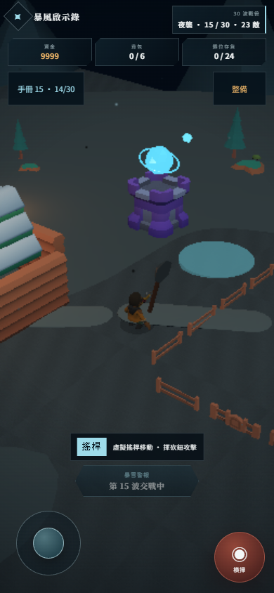

# 《暴風啟示錄》R4 手機 P0 修復回應

基準：`cf1e709`。未執行 `git commit`／`git push`。

## 結論

- 「一層霧」已修：手機低檔不再使用亮灰霧底，改為低密度深藍灰霧、較低環境光與曝光、較高對比；夜襲時仍保有冷藍雪地、遠景層次與 vignette，不再是乳白低對比。
- 「不能玩」的主要風險已降：低檔完全不建立即時陰影、GlowLayer、DefaultRenderingPipeline、FXAA、MSAA；改用角色 blob shadow，渲染解析度明確不超過 1×，持續低 FPS 時再降至 0.8×／0.65×。
- 觸控輸入沒有綁在 render callback：pointer handler 立即更新 joystick／held／queued 狀態，單次攻擊不會因低幀遺失。正式模擬 `dt` 上限由 50ms 放寬為 100ms，10–20 FPS 時不再額外把移動與戰鬥節奏砍半。
- `npm run test:smoke` 三視口 `31/31`；`npm run build` 通過，TypeScript 零錯。

## 視覺取證

修前 390×844：亮灰霧佔滿遠景，雪地、天空、山體接近同一明度。

修後使用 Playwright 的正常產品 URL、同一份 Ch14 fixture、同一個第 15 波夜襲狀態取證。桌機由真實偵測選「高」，手機 UA＋touch 選「低」，沒有用 query 強制兩者同檔。

| 桌機 1440×900，高檔 | 手機 390×844，低檔 |
| --- | --- |
|  |  |

執行時證據：

| 視口 | 品質 | renderScale | 陰影 | 夜襲 fogDensity |
| --- | --- | ---: | --- | ---: |
| 1440×900 | 高 | 1.00 | realtime | 0.0197 |
| 390×844 | 低 | 0.65（SwiftShader 低幀自動 Tier 2） | blob | 0.0075 |

兩張修後圖的冷藍灰色相一致；手機保留更深的天空／地面對比，塔、角色、雪徑與遠景邊界可辨。0.65× 自動降檔下仍未回到乳白霧，也沒有關掉 `.vignette`。

## 實作摘要

### 手機低檔視覺

- 黎明／夜襲 fogDensity 改為 `0.0045 → 0.0075`；fogColor 與 clearColor 改為深藍灰。
- environmentIntensity 降至 `0.44`，HemisphericLight／sun／暖光重新平衡。
- 低檔使用 scene material-pass 的 `contrast=1.32`、`exposure=0.88`，不配置後製 pipeline。
- `.vignette` 與既有 `pointer-events:none` 路徑未更動。

### 手機低檔效能

- `Engine`：antialias off、stencil off、preserveDrawingBuffer off；Babylon hardware scaling 改用明確的反比換算，低檔 base renderScale `≤1.0`。
- 連續三次、每 2 秒採樣低於 28 FPS 時，一路降至 0.8×、再降至 0.65×；同步下修雪與營火 emitRate。
- 不建立 512 shadow map；低檔 `ShadowGenerator` 為 `undefined`，動態角色用共用透明材質的 12 邊 blob shadow。
- 雪粒子由 capacity/rate `420/120` 降為 `220/55`，自動 Tier 1/2 再降 rate `32/18`；營火由 `120/85` 降為 `48/32`，再降 `18/10`。
- 低檔 HUD DOM 更新節流為 10 Hz；遊戲輸入事件本身維持即時。
- 21 個 GLB 不再一次全併發：低檔 3 路、其他 5 路 worker。此修正消除了完整 smoke 中的 `ERR_SOCKET_NOT_CONNECTED`，也降低手機啟動時的連線、解析與記憶體尖峰。

### 觸控／低 FPS 稽核

- joystick 在 `pointerdown` 立即設定方向並使用 pointer capture；`pointermove` 只更新最新向量，模擬幀讀取持久狀態。
- 攻擊鈕在 `pointerdown` 立即設 `attackQueued + attackHeld`；queue 直到下一個 simulation update 才 consume，所以單次觸控不會在幀間消失。
- `pointerup`／`pointercancel`／window blur 會清除 held 與 joystick；低幀下不會卡住連發或方向。
- 正式 `dt` clamp `0.05 → 0.1`，避免 10–20 FPS 裝置產生額外遊戲慢動作。

## 驗收

- `npm run test:smoke`：`31/31 checks passed; 0 failed`
  - 1440×900：9/9，鍵盤移動／SMG／波次／console 全綠。
  - 390×844：16/16，pointerdown、面板攔截、hit target、joystick、長按 SMG、波次、console 全綠。
  - 844×390：6/6，面板與雙控制熱區、console 全綠。
- `npm run build`：成功；`tsc --noEmit` 零錯。
- `git diff --check`：成功，只有既有 Windows LF/CRLF 提示。

限制：本輪沒有實體手機 GPU，因此不宣稱已量到真機固定 30 FPS；已完成的是 30 FPS 目標所需的低檔成本移除、解析度自動降級與低幀輸入／時間步補償。Playwright SwiftShader 會降到 Tier 2，不可拿其 FPS 數字代替真機量測。
