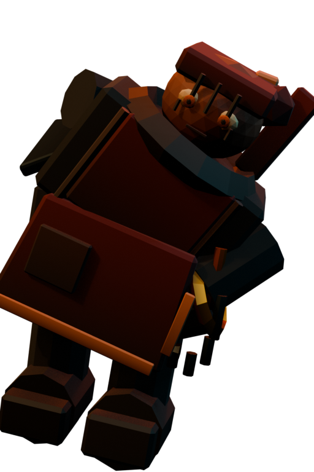
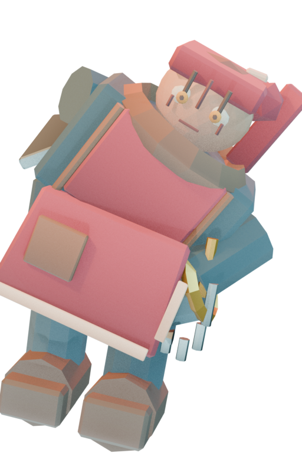
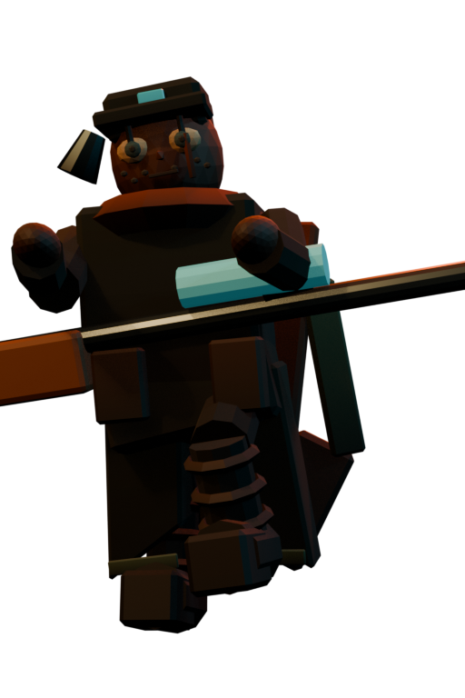
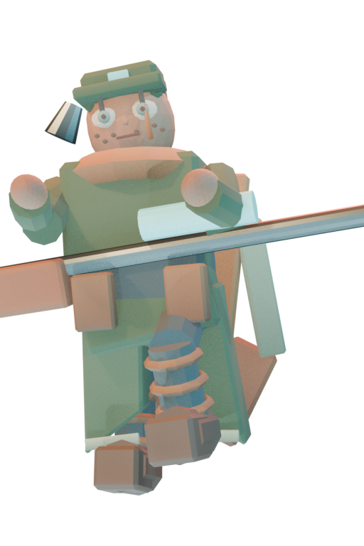
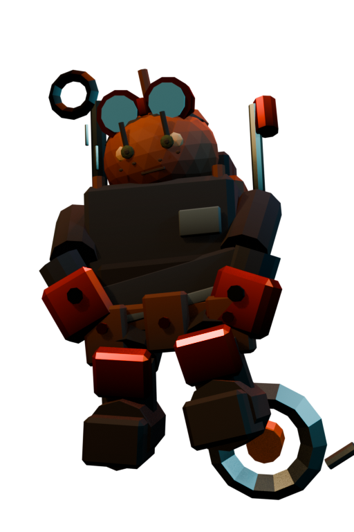
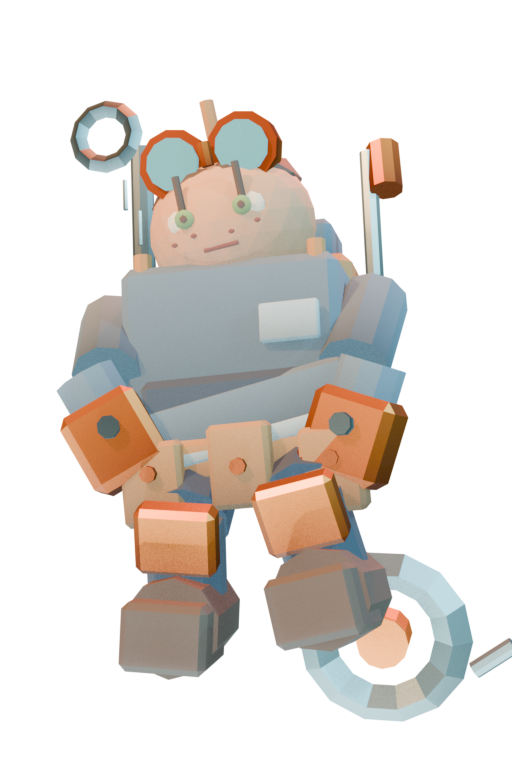
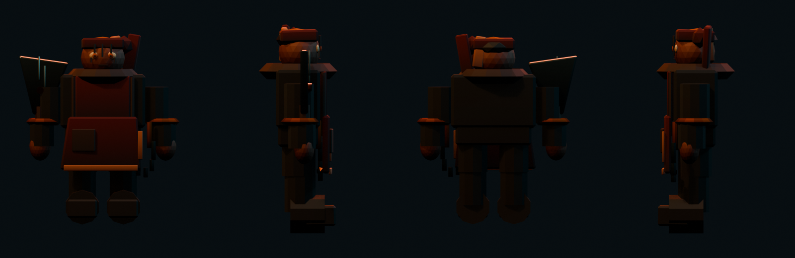
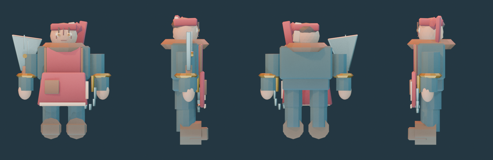
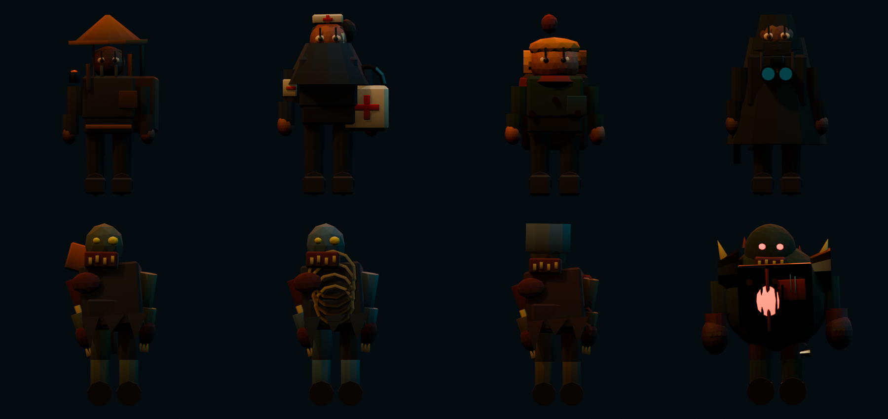

# Storm Apocalypse R8.1 渲染曝光修復報告

日期：2026-07-15

## 結論

R8.1 已完成曝光、材質明度與遊戲內可讀性專修。未修改 R8 的建模幾何、rig、動畫或色票色相；三主角、NPC、三種殭屍與 Boss 的 `POSITION`、`NORMAL`、indices、`JOINTS_0`、`WEIGHTS_0` 與 inverse bind matrices 均與 commit `05742e4` 逐位元一致，變更只落在 `COLOR_0` 材質色資料與渲染／遊戲光照。

## 根因與修復

- R8 把 scene-linear 色值寫進 `color_srgb`，造成 `COLOR_0` 被二次轉換並壓黑。R8.1 改為直接寫入 scene-linear／glTF linear 資料。
- 材質管線以 HSV 保留既有色相與飽和度，只把角色 albedo value 約束在 `0.25–0.80`，深色仍保有色彩，亮點色不再埋進黑部。
- Blender 共用預設改為 AgX Base、`+1.25 EV`；key 提升至 `1400 W / 5.8 m`、fill `850 W / 6.5 m`、rim `1050 W / 3.4 m`，新增 `620 W / 7.5 m` bounce fill。
- 遊戲提高 environment／hemispheric light 與地面反射貢獻，並降低高、低畫質的壓暗對比；玩家在雪地場景可辨識服裝主色、頭部與亮點色。
- 新增 `scripts/check-portrait-luminance.mjs`，檢查九張 high／medium／low 立繪與三檔主選單背景；規格為不透明像素平均亮度 `0.22–0.75`、近黑像素 `< 0.08` 比例 `< 40%`。檢查已直接併入 smoke。

## 量測前後

亮度採 sRGB luma `0.2126R + 0.7152G + 0.0722B`，不透明像素定義為 alpha ≥ 128。

| 資產 | R8 平均／近黑 | R8.1 平均／近黑 | 結果 |
| --- | ---: | ---: | --- |
| 屠宰女掌櫃 high | 0.061／75.1% | 0.562／0.0% | PASS |
| 退伍狙擊手 high | 0.083／71.7% | 0.567／0.0% | PASS |
| 機械青年 high | 0.119／46.6% | 0.619／0.0% | PASS |
| 主選單背景 high | 0.203／29.6% | 0.413／0.0% | PASS |
| 三組 turntable | 0.049–0.053／94.4–96.1% | 0.294–0.302／0.0% | PASS |
| 敵人／Boss／NPC cast | 0.045／94.5% | 0.290／0.0% | PASS |

九張立繪最終平均亮度為 `0.562–0.619`，三檔主選單背景為 `0.413–0.414`；十二張閘門資產全部通過。

## 視覺前後對比

| 項目 | R8（修前） | R8.1（修後） |
| --- | --- | --- |
| 屠宰女掌櫃立繪 |  |  |
| 退伍狙擊手立繪 |  |  |
| 機械青年立繪 |  |  |
| 屠宰女掌櫃 turntable |  |  |
| 敵人／Boss／NPC cast |  |  |
| 遊戲線上視角 |  |  |

完整 R8.1 證據仍位於 [`docs/evidence/R8/`](evidence/R8/)；已重渲染三組 turntable、三主角 silhouette、敵人／Boss／NPC cast、三張 hero art、主選單背景與線上視角。修前 R8 圖以 `before-r8-*` 保留供稽核。

## 驗收結果

| 驗收 | 結果 |
| --- | --- |
| `node scripts/check-portrait-luminance.mjs` | 12/12 PASS |
| `npm run test:smoke` | 79/79 PASS（含亮度閘門） |
| `npm run test:smoke:headed` | 4/4 PASS（原有 3 項＋R8.1 亮度閘門）；Chrome 30 秒 WebGL warnings = 0 |
| `npm run typecheck` | PASS |
| `npm run build` | PASS |
| 幾何／rig 二進位核對 | 11 個角色 GLB 的幾何、skin 與骨架資料 0 差異 |
| 秘密掃描 | 0 命中 |

效能證據：[`performance-r8.json`](evidence/R8/performance-r8.json)。條件為 Chromium ANGLE D3D11、wave 25、12 秒暖機、每跑 6 秒採樣。

| Profile | Run 1 | Run 2 | Run 3 | 結果 |
| --- | ---: | ---: | ---: | --- |
| Desktop 1440×900 | 16.7ms | 16.8ms | 16.8ms | PASS，三跑皆 ≤ 18ms |
| Mobile 390×844 | 16.8ms | 16.7ms | 16.8ms | PASS，三跑皆 ≤ 18ms |

本輪只建立本地 commit，不 push。
