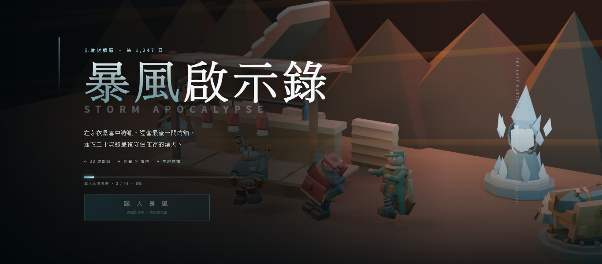
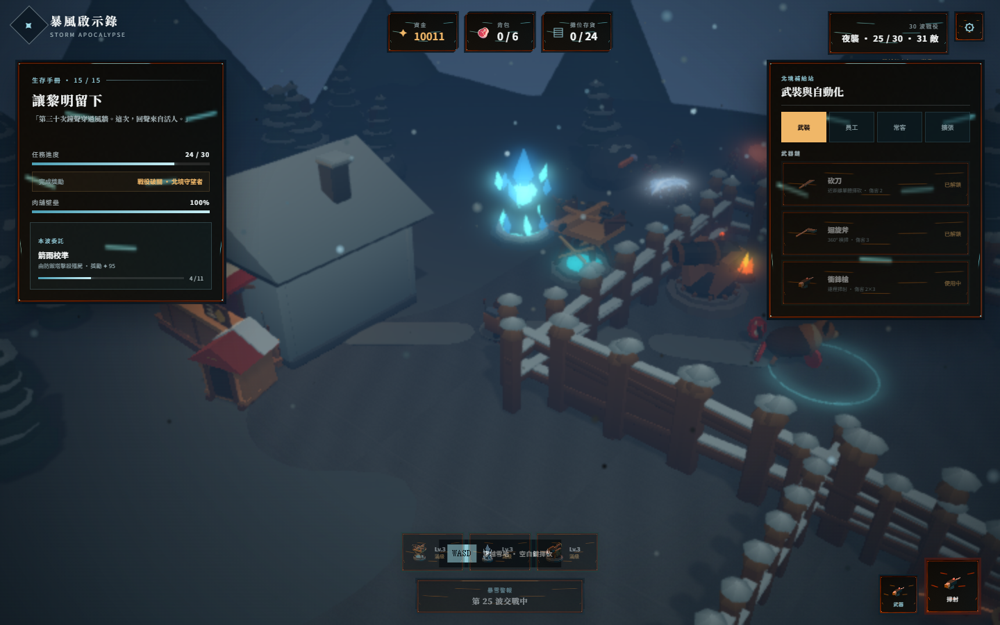

# storm R15（Wave 2）驗收證據

日期：2026-07-17
範圍：主選單／宣傳 key art、程序性風雪強度與品質密度分級。未修改傷害、生命、速度、AI、碰撞、輸入、波次、經濟或角色動畫資產。

## 1. key art 與來源治理

| 項目 | 結果 |
|---|---|
| imagegen model | `gpt-image-2` |
| 原始 master | `masters/storm-r15-key-art-gpt-image-2.png`，1,672×941，1,883,344 B |
| master SHA-256 | `4614816946c2cbc6df96d3c956e3633e78d6a9d057bebdfab4de90088c787eab` |
| C2PA | `caBX` 1 chunk；CRC 全有效；`softwareAgent = gpt-image 2.0`；PASS |
| cover | 兩份皆 1,280×640、1,034,816 B、SHA-256 `326a67a2c3ff77112d6457582c56457ba9759f7d93e4042e7935a435a2629c71` |
| cover 同步 | `assets/cover.png` 與 `public/images/cover.png` byte-for-byte 相同 |
| 社群引用 | `image_src`、`og:image`、`og:image:secure_url`、`twitter:image` 均為 `cover.png?v=326a67a2` |

- C2PA 機器驗證：[c2pa-verification.json](c2pa-verification.json)
- 完整輸入／衍生檔 hash、尺寸、後製參數：[source-manifest-r15.json](source-manifest-r15.json)
- prompt 與禁止條件：[prompt-template.md](prompt-template.md)
- 視覺語言／安全焦點：[style-board.md](style-board.md)
- master 保持原始 bytes；runtime 衍生圖透過 master SHA-256 回指，不宣稱衍生圖仍含 C2PA。

## 2. 首屏、RWD 與記憶體

`scripts/validate-r15-visuals.mjs` 在 Fast 3G＋4× CPU 下實測：

- key-art performance mark：`287.4 ms`，門檻 `≤3,000 ms`。
- 首次可互動：`14,564.1 ms`；before 下限 `>240,000 ms`，未超過 10% regression ceiling `264,000 ms`。
- 1,366×600、390×844、844×390 的共同焦點 bbox 均留在 safe area。
- 三個 viewport 的可見文字最低對比皆 `≥4.5:1`。
- 桌機新增 decoded texture：key art 9,446,400 B＋程序天候 266,240 B＝`9,712,640 B`（9.26 MiB），門檻 64 MiB。
- 行動新增 decoded texture：key art 1,152,000 B＋程序天候 266,240 B＝`1,418,240 B`（1.35 MiB），門檻 32 MiB。
- 首屏用 320×180、4,716 B 的同源 WebP preview data URI；之後才非阻塞升級 medium/high。

機器結果：[visual-validation-r15.json](visual-validation-r15.json)；首屏細節：[visual-first-screen-r15.json](visual-first-screen-r15.json)。

## 3. 程序性風雪管線

管線：Babylon.js 兩層 CPU particle systems＋scene image processing／cinematic post。粒子貼圖與 veil 由 runtime canvas 產生；不需要 C2PA。完整 color、motion、life、size、fog、exposure、contrast、vignette、bloom 與 source hash 見 [weather-pipeline-r15.json](weather-pipeline-r15.json)。

| 強度 | far rate | near rate | veil alpha | contrast | exposure |
|---|---:|---:|---:|---:|---:|
| low | 90 | 10 | 0.05 | 1.10 | 1.08 |
| medium | 220 | 26 | 0.10 | 1.14 | 1.10 |
| high | 300 | 36 | 0.16 | 1.20 | 1.12 |

生產映射只讀既有狀態：非戰鬥為 low、一般／菁英戰鬥為 medium、whiteout／boss 為 high；`gameplayMutation = none`。

品質密度為低 `0.32`、中 `0.68`、高 `1.00`。固定 high 強度時實測 rate：

| 品質 | far / near | behavior signature | post signature |
|---|---:|---|---|
| low | 96 / 12 | 與中／高完全相同 | 與中／高完全相同 |
| medium | 204 / 24 | 與低／高完全相同 | 與低／高完全相同 |
| high | 300 / 36 | 與低／中完全相同 | 與低／中完全相同 |

## 4. 最高暴雪可讀性

腳本等待實際 VFX counter 增加與命中點投影後，凍結該 active hit frame，再做局部像素斷言：

- 敵人 silhouette 局部對比：`1.97`，PASS。
- ice-white 命中回饋局部對比：`1.80`，PASS；當下 `data-vfx-events = 20`。
- HUD 可見文字最低對比：performance chip `5.80:1`；其餘 wave／money／health 為 10.33–17.11:1，PASS。
- 敵人 hurt／death、角色 walk limb pose、攻擊 anticipation／active impact／recovery 與 impact-frame damage 仍由既有 smoke 守門；沒有以整張圖片 bobbing 假裝動畫。

完整視覺集合：`19/19 PASS`、0 failure，見 [visual-validation-r15.json](visual-validation-r15.json)。

## 5. 效能與全量回歸

- `node scripts/measure-performance.mjs`：desktop 16.8／16.7／16.7 ms；mobile 16.8／16.7／16.7 ms。六筆皆 `≤18 ms`、console errors 皆 0、`allProfilesPass=true`。完整 tier、實際 weather rate、draw calls 與 active meshes 見 [performance-after-r15.json](performance-after-r15.json)。
- desktop 第 2 筆在主機壓力下進入 tier 2，仍為 16.7 ms；其餘 desktop 為 tier 1。mobile low 三筆維持 tier 0，實際 medium weather rate 均為 70／8。
- Production `npm run typecheck`＋`npm run build`：PASS；log 見 [build-r15.log](build-r15.log)。
- CI 同款 `npm run test:smoke`：`152/152 PASS`、0 failure、`allPass=true`，見 [smoke-r15.json](smoke-r15.json)。
- 受背景 Playwright MCP SwiftShader 與 1,050 MHz 主機時脈污染的效能嘗試均原樣保留為 `performance-attempt*.json`、`performance-host-polluted-r15.json`，不拿失敗樣本冒充通過。

## 6. 快取、秘密、回滾

- repo 無 service worker、Workbox 或 webmanifest；PWA cache／offline precache 為 N/A。
- 新 runtime key art 引用皆帶 SHA-256 前 8 碼 query。
- shipping `src/`、`index.html`、`package.json`、`public/` 中舊 `0.2.7`／`R14` marker：0 命中。
- 秘密掃描 `sk-proj-*`、長格式 `sk-*`、`xai-*`（排除 `.git`、`node_modules`、build 暫存）：0 命中。
- `git diff --check`：PASS（僅 Git 的 LF→CRLF 工作樹提示，無 whitespace error）。
- 回滾：`git revert <R15-local-commit>` 可一次回復 R14 runtime、art、manifest 與 harness；本輪只建立 local commit，不 push。
